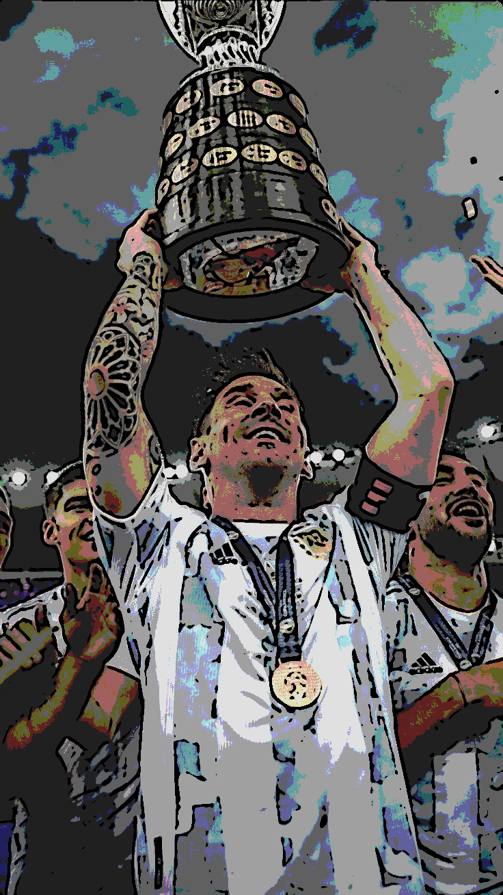

# Cartoonize Image 

## Introduction
This project aims to convert a regular image into a cartoon-style image using various image processing techniques. It utilizes libraries like OpenCV in Python to perform blurring, edge detection, and color quantization to achieve the cartoon effect. The code provided in this project is a step-by-step guide on how to achieve this transformation.

## Table of Contents
- [Getting Started](#getting-started)
- [Prerequisites](#prerequisites)
- [Usage](#usage)
- [Methodology](#methodology)
  - [Image Preprocessing](#image-preprocessing)
  - [Edge Detection](#edge-detection)
  - [Color Quantization](#color-quantization)
- [Result](#result)
- [Contributing](#contributing)
- [License](#license)

## Getting Started
To get started with this project, you will need to clone the repository to your local machine and ensure that you have all the necessary prerequisites installed.

## Prerequisites
Before running the code, make sure you have the following libraries installed:

- Python 
- OpenCV (cv2)
- NumPy

You can install these dependencies using pip:
```bash
pip install opencv-python numpy
```
## Usage
1. Place the image you want to cartoonize in the same directory as the project.
2. Modify the `img = cv2.imread('input_image.jpg')` line in the code to specify the name of your input image.
3. Run the Python script `cartoonize_image.py`.
4. The resulting cartoonized image will be saved as 'Cartoonimage.png' in the same directory.

## Methodology

### Image Preprocessing
The input image undergoes several preprocessing steps to prepare it for cartoonization:
- Gaussian Blurring
- Median Blurring
- Bilateral Filtering

### Edge Detection
Laplacian filters are applied to the preprocessed images to detect edges.

### Color Quantization
- K-means clustering is used for color quantization to reduce the number of distinct colors in the image.
- The image is divided into clusters, and the colors are replaced with cluster centers.

## Result
The resulting image is a cartoon-style representation of the input image with enhanced edges and reduced color variation.


## Contributing
Contributions to this project are welcome. You can contribute by adding new features, optimizing code, or improving documentation.
